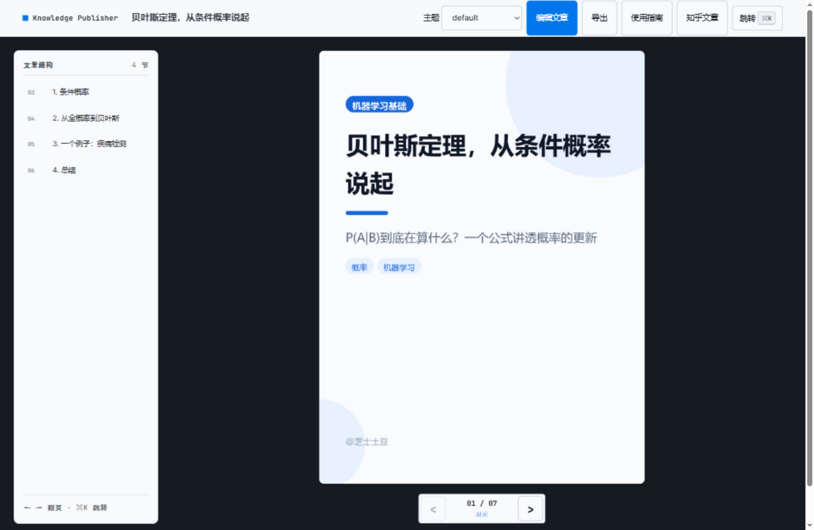
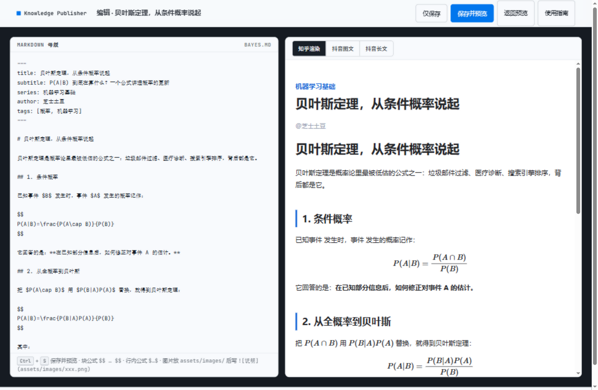

# Knowledge Publisher（KP）

**一次创作，多平台输出。** 你只负责写一份 Markdown 母稿，系统负责检查、渲染、转换——生成知乎文章、抖音长文（公式自动转图片）与抖音图文 PNG 图集。

> 技术栈：Python · markdown-it-py（AST 中间层）· matplotlib（LaTeX→PNG）· Pygments · Pillow · FastAPI · Typer





```
                  你
                  │
                  ▼
           ┌─────────────┐
           │  Markdown   │
           │   母版       │
           └──────┬──────┘
                  │
                  ▼
        ┌───────────────────┐
        │ Knowledge Engine  │
        │   内容生产引擎     │
        └─────────┬─────────┘
                  │
       ┌──────────┼──────────┐
       ▼          ▼          ▼
     AST 中间层   分页器      检查器
       │          │          │
       ▼          ▼          ▼
    知乎发布包   抖音PNG图集  报告
```

核心设计原则：

- **母版不针对任何平台**，只表达知识本身
- **AST 中间层**是所有渲染器的统一语言，新平台只写新 Renderer
- **分页按内容块（视觉单元）**，不按字数；公式与引导段落保持同页
- **公式确定性渲染**：LaTeX → matplotlib mathtext → PNG，绝不交给平台"猜"
- **样式全部来自 YAML 模板**，换风格不换代码
- **AI 只做内容辅助，不控制核心渲染**（解析/渲染/分页/输出全是确定性程序）

## 技术栈

| 模块 | 技术 |
| ---- | ---- |
| 核心语言 | Python 3.11 |
| Markdown 解析 | `markdown-it-py` + `mdit-py-plugins`（texmath） |
| AST | 自定义节点模型（`src/ast_nodes.py`） |
| 公式渲染 | matplotlib mathtext（LaTeX → PNG，离线） |
| 代码高亮 | Pygments |
| 图片处理 | Pillow |
| HTML | Jinja2 |
| 配置 | YAML |
| CLI | Typer |
| 预览 | FastAPI + uvicorn |

## 安装

使用独立的 Conda 环境（推荐）：

```bash
conda env create -f environment.yml
conda activate kp
```

或使用已有 Python：

```bash
pip install -r requirements.txt
```

## 日常启动（最简单的方式）

**双击项目目录里的 `启动系统.bat`** —— 自动启动系统并打开浏览器，
平时不需要碰命令行；如果系统已经在运行，它会直接帮你打开浏览器。
（「构建文章.bat」可以一键构建指定文章的全部平台产物。）

想用命令行启动也可以：

```bash
conda activate kp
python main.py preview          # 打开文章列表首页
python main.py preview bayes    # 直接打开某篇文章的预览
```

## 分享给其他人

把整个项目文件夹拷给对方即可，对方只需要两步：

1. 双击 **`首次安装.bat`** —— 自动创建运行环境并安装依赖（需要联网，约 2-5 分钟；
   前提是电脑上装有 Python 3.9+ 或 Anaconda）
2. 双击 **`启动系统.bat`** —— 开始使用

启动脚本会自动寻找 Python：优先使用项目内的 `.venv`，其次 Anaconda 环境，
最后是系统 PATH 上的 Python（自动跳过 Windows 商店的占位符）。

说明：
- 你的文章（`articles/`）和成品（`output/`）都在文件夹里，会一起带走
- 系统本身不绑定你的电脑，路径全部相对项目目录
- 中文界面依赖 Windows 自带字体（微软雅黑 / Consolas），非 Windows 系统需要把字体放进 `assets/fonts/`

## 快速上手

```bash
# 1. 创建文章母版
kp new bayes --category math --series "机器学习基础"

# 2. 检查内容（Markdown / LaTeX / 图片 / 标题层级 / 段落密度）
kp check bayes

# 3. 生成知乎发布包
kp build bayes --platform zhihu

# 4. 生成抖音图文图集（1080×1440 PNG）
kp build bayes --platform douyin

# 5. 全部生成
kp build bayes --all

# 6. 本地预览（浏览器实时看抖音效果，改完 Markdown 刷新即可）
kp preview bayes
```

**也可以全程在浏览器里操作**：启动 `kp preview` 后打开首页，右上角「新建文章」、
每篇文章右侧「编辑」按钮进入在线编辑器——左边写 Markdown、右边实时渲染，
点「保存并预览」（或 `Ctrl+S`）自动完成检查 + 知乎生成 + 抖音生成并跳转预览。
系统内置「使用指南」页面（顶栏入口），讲清了发布到知乎/抖音的具体步骤。

命令一览：

| 命令 | 说明 |
| ---- | ---- |
| `kp new <name> [-c category] [-s series]` | 创建 Markdown 母版 |
| `kp ls` | 列出所有文章 |
| `kp check [name]` | 检查文章（省略名称则检查全部） |
| `kp build <name> [--platform zhihu\|douyin\|douyin-article\|all] [--template theme]` | 生成发布包 |
| `kp preview <name> [--port 8765] [--theme theme]` | 启动本地预览服务 |

三种输出：

| 输出 | 位置 | 用途 |
| ---- | ---- | ---- |
| 知乎文章 | `output/<文章>/zhihu/article.md` | 粘贴到知乎编辑器（公式自动渲染） |
| 抖音长文 | `output/<文章>/douyin-article/article.html` | **公式已转图片**的自包含 HTML，浏览器全选复制即可粘贴到抖音文章编辑器 |
| 抖音图文 | `output/<文章>/douyin/*.png` | 3:4 图片轮播，按顺序上传 |

## 目录结构

```
knowledge-publisher/
├── articles/                 # 你的知识源文件（Markdown 母版）
│   ├── math/                 #   按分类存放
│   └── computer/
├── assets/
│   ├── images/               # 原始图片
│   ├── diagrams/             # 图表（V1 建议 PNG）
│   └── fonts/                # 自定义字体（可选）
├── templates/
│   ├── douyin/               # 抖音模板（YAML，可换风格）
│   │   ├── default.yaml      #   基础样式
│   │   ├── cover.yaml        #   封面页
│   │   ├── formula.yaml      #   公式面板
│   │   ├── code.yaml         #   代码卡片
│   │   └── summary.yaml      #   结尾卡片
│   └── zhihu/
│       └── article.html.j2   # 知乎 HTML 模板
├── config/global.yaml        # 全局配置（检查阈值 / 默认作者）
├── src/
│   ├── ast_nodes.py          # AST 中间层
│   ├── parser.py             # Markdown → AST
│   ├── validator.py          # 内容检查器
│   ├── paginator.py          # 抖音分页器
│   ├── renderer/
│   │   ├── latex.py          # LaTeX → PNG
│   │   ├── fonts.py          # 中英文字体
│   │   ├── zhihu.py          # 知乎 Renderer
│   │   └── douyin.py         # 抖音 Canvas Renderer
│   ├── preview.py            # FastAPI 预览服务
│   └── cli.py                # kp CLI
├── output/                   # 生成结果
│   └── <文章>/
│       ├── zhihu/            #   article.md + article.html + assets/
│       └── douyin/           #   01.png 02.png ... + pages.json
└── tests/
```

## 母版规范（V1.0）

支持元素：**标题、段落、粗体、斜体、列表、引用、代码、公式、图片、表格、分割线、链接**。

公式规范（重要）：

- 块公式：`$$ ... $$`（内容可多行）
- 行内公式：`$ ... $`
- 系统自己负责渲染，抖音输出里**永远不会出现 `$`**（已被渲染成图片）

文章头部可加 YAML frontmatter（可选）：

```markdown
---
title: 梯度下降到底是什么？
subtitle: 一句话副标题（用于抖音封面）
series: 机器学习基础
author: 苏同学
tags: [机器学习, 优化]
---

# 梯度下降到底是什么？
...
```

## 主题（换风格）

内置三个主题，改 `--template` 即可切换，产出互不覆盖（命名主题输出到
`output/<文章>/douyin/<主题名>/`）：

| 主题 | 风格 |
| ---- | ---- |
| `default` | 白底 · 科技蓝（默认） |
| `tech-blue` | 深蓝底 · 亮蓝点缀 |
| `black-gold` | 黑底 · 金色点缀 |

```bash
kp build bayes --template black-gold
kp preview bayes --theme tech-blue
```

**预览器顶栏有「风格」下拉框**，可以随时在浏览器里切换主题、对比效果
（切换时服务端会自动生成该主题的图集，首次切换会等几秒）。

预览界面本身是一个**工作台式设计**（Hallmark / Cobalt 主题）：左侧文章结构大纲、
中间石墨画布区实时展示抖音页面、右侧检查面板（当前页类型 / 文件 / 画布尺寸），
支持 `← →` 翻页与 **`⌘K` 命令面板**（按标题模糊搜索直接跳页）。
界面样式令牌集中在 `tokens.css`，想改预览器配色只动这一个文件。

### 自定义主题

主题就是 `templates/douyin/<主题名>/` 目录下的一组 YAML，只需写想覆盖的部分，
其余继承全局配置：

```text
templates/douyin/
├── default.yaml      # 全局基底：画布 / 字号 / 配色 / 间距
├── cover.yaml        # 封面页
├── formula.yaml      # 公式面板（含 pygments_style 代码高亮配色）
├── code.yaml         # 代码卡片
└── summary.yaml      # 结尾卡片
```

例如「黑金」主题的核心就是一个 `default.yaml`：

```yaml
colors:
  background: "#0D0D0F"
  text: "#F5F0E6"
  accent: "#D4A843"       # 金
  code_background: "#161310"
  ...
```

新增主题 = 新建一个目录放 YAML，预览器下拉框会自动出现这个主题，零代码。

## 检查器输出示例

```text
Knowledge Publisher Check

  ✓ Markdown       OK
  ✓ LaTeX          18 formulas
  ✓ Images         7 found
  ✓ Code blocks    5
  ✓ Tables         2

  ⚠ Warning:
    段落过长（412 字符，建议 ≤ 350）：…

  ✗ Error:
    公式 13 无法渲染（花括号不配对（1 个 '{'，0 个 '}'））：$\frac{1}{…$
```

`kp build` 前会自动运行检查，有错误会中止构建，避免产出坏图。

## 运行测试

```bash
python -m pytest tests -q
```

## 路线图

- **V1.0（当前）**：Markdown → 检查 → 知乎 → 抖音
- **V2.0**：模板管理、更多主题、自动分页优化、导出 PDF
- **V3.0**：AI 辅助（生成标题/摘要/拆知识点/视频脚本）
- **V4.0**：小红书、公众号、个人博客等多平台 Renderer
